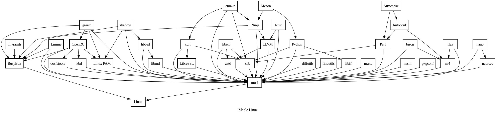

# Maple Linux Bootstrapping Scripts

These are the scripts I wrote to bootstrap Maple Linux. At the time of writing this "read me" file, they are incredibly hacky and require a lot of fixes to work properly long-term. The workflow is as follows:

```
./prepare.sh           # Downloads the sources from the Internet
./bootstrap.sh         # Builds the low-level system utilities such as Busybox, LLVM, and musl
doas ./chroot.sh root/ # Changes the root of the session to interact with Maple Linux
./basebuild.sh         # Builds the system components inside the chroot
```

If all goes well, this should give you a functional copy of Maple Linux. Please report any issues you may find.

